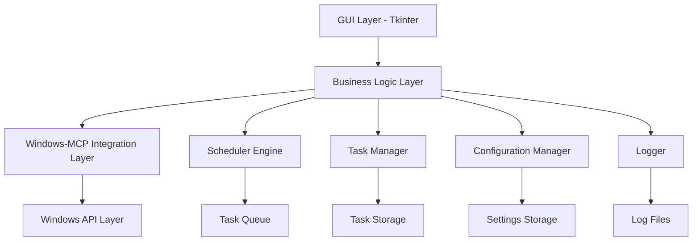
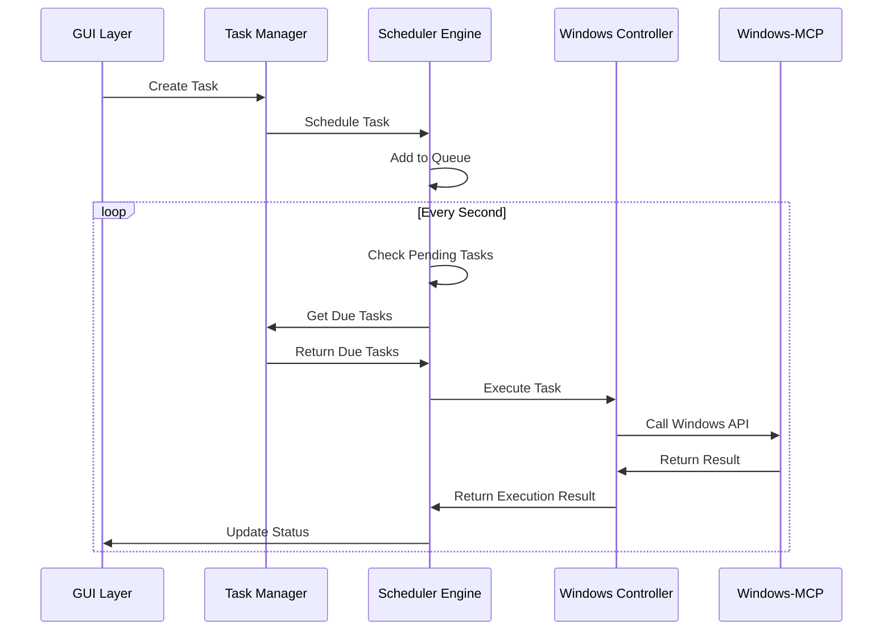
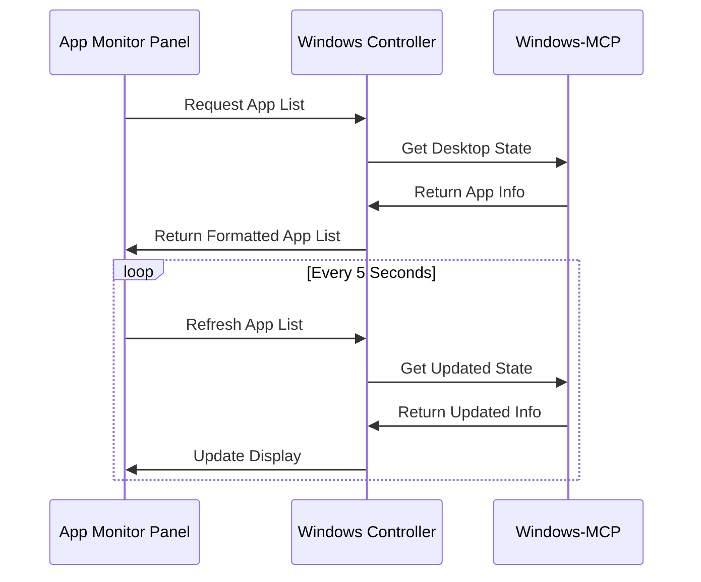

# Windows排程控制GUI設計文件

## 概述

本設計文件描述了一個基於Python Tkinter的Windows應用程式排程控制系統。該系統將整合現有的Windows-MCP功能，提供使用者友善的圖形介面來管理和自動化Windows應用程式的操作。

## 開發環境設定

### 技術棧
- **Python**: 3.13+
- **包管理器**: uv (現代化的Python包管理器)
- **GUI框架**: Tkinter
- **虛擬環境**: uv venv
- **依賴管理**: pyproject.toml

### 專案結構
```
windows-scheduler-gui/
├── pyproject.toml          # uv專案配置文件
├── .python-version         # Python版本指定
├── src/
│   ├── models/            # 資料模型
│   ├── gui/               # GUI元件
│   ├── core/              # 核心業務邏輯
│   ├── storage/           # 資料存取層
│   └── utils/             # 工具函數
├── tests/                 # 測試文件
├── docs/                  # 文檔
└── .venv/                 # uv虛擬環境
```

### pyproject.toml 範例配置
```toml
[project]
name = "windows-scheduler-gui"
version = "0.1.0"
description = "Windows應用程式排程控制GUI"
authors = [
    {name = "Your Name", email = "your.email@example.com"}
]
readme = "README.md"
requires-python = ">=3.13"
dependencies = [
    "pathlib",
    "datetime",
    "json",
    "threading",
    "tkinter",
]

[project.optional-dependencies]
dev = [
    "pytest>=7.0",
    "black>=23.0",
    "flake8>=6.0",
    "mypy>=1.0",
]

[build-system]
requires = ["hatchling"]
build-backend = "hatchling.build"

[tool.black]
line-length = 88
target-version = ['py313']

[tool.mypy]
python_version = "3.13"
warn_return_any = true
warn_unused_configs = true
```

### uv 常用命令參考

**專案初始化和環境管理：**
```bash
# 初始化新專案
uv init windows-scheduler-gui

# 建立虛擬環境
uv venv

# 激活虛擬環境 (Windows)
.venv\Scripts\activate

# 安裝依賴
uv add package-name

# 安裝開發依賴
uv add --dev pytest black flake8 mypy

# 從pyproject.toml安裝所有依賴
uv sync
```

**開發和測試命令：**
```bash
# 運行應用程式
uv run python src/main.py

# 運行測試
uv run pytest

# 代碼格式化
uv run black src/

# 代碼檢查
uv run flake8 src/

# 類型檢查
uv run mypy src/
```

## 架構設計

### 整體架構



### 模組架構

系統採用分層架構設計，主要包含以下層次：

1. **GUI層 (Presentation Layer)** - 使用Tkinter實現的使用者介面
2. **業務邏輯層 (Business Logic Layer)** - 核心業務邏輯處理
3. **整合層 (Integration Layer)** - 與Windows-MCP的整合介面
4. **資料層 (Data Layer)** - 資料持久化和管理

## 元件設計

### 1. GUI元件 (gui/)

#### 1.1 主視窗 (MainWindow)
```python
class MainWindow:
    - menu_bar: MenuBar
    - toolbar: ToolBar  
    - main_frame: MainFrame
    - status_bar: StatusBar
    
    + __init__(self)
    + setup_ui(self)
    + show(self)
    + close(self)
```

**職責：**
- 管理主視窗佈局
- 協調各個子元件
- 處理視窗事件

#### 1.2 任務管理面板 (TaskPanel)
```python
class TaskPanel:
    - task_list: TaskListWidget
    - task_detail: TaskDetailWidget
    - control_buttons: ControlButtonsWidget
    
    + refresh_tasks(self)
    + create_task(self)
    + edit_task(self, task_id)
    + delete_task(self, task_id)
    + execute_task(self, task_id)
```

**職責：**
- 顯示任務清單
- 提供任務操作介面
- 處理任務相關的使用者互動

#### 1.3 應用程式監控面板 (AppMonitorPanel)
```python
class AppMonitorPanel:
    - app_list: AppListWidget
    - app_detail: AppDetailWidget
    - refresh_button: RefreshButton
    
    + refresh_apps(self)
    + select_app(self, app_name)
    + get_app_info(self, app_name)
```

**職責：**
- 顯示當前運行的應用程式
- 提供應用程式詳細資訊
- 支援應用程式選擇功能

#### 1.4 排程詳細頁面 (ScheduleDetailPage)
```python
class ScheduleDetailPage:
    - header: HeaderWidget
    - schedule_info: ScheduleInfoWidget
    - options_panel: OptionsPanel
    - action_buttons: ActionButtonsWidget
    
    + load_schedule(self, schedule_id: str)
    + refresh_display(self)
    + edit_schedule(self)
    + delete_schedule(self)
    + toggle_schedule(self)

class ScheduleInfoWidget:
    - name_label: Label
    - target_window_label: Label
    - trigger_time_label: Label
    - action_label: Label
    
    + update_info(self, schedule: Schedule)

class OptionsPanel:
    - repeat_option: OptionRow
    - conditional_trigger_option: OptionRow
    - advanced_options: AdvancedOptionsWidget
    
    + update_options(self, schedule: Schedule)
```

**職責：**
- 顯示排程的詳細資訊
- 提供排程編輯和管理功能
- 支援條件觸發和進階選項顯示

#### 1.5 排程建立/編輯對話框 (ScheduleDialog)
```python
class ScheduleDialog:
    - schedule_name: Entry
    - target_app: ComboBox
    - action_type: ActionTypeWidget
    - trigger_time: TriggerTimeWidget
    - options: OptionsWidget
    - preview: ExecutionPreviewWidget
    
    + validate_schedule(self)
    + get_schedule_config(self)
    + set_schedule_config(self, config)
    + update_preview(self)

class TriggerTimeWidget:
    - schedule_type: RadioButtonGroup
    - time_picker: TimePickerWidget
    - date_picker: DatePickerWidget
    - days_selector: DaysSelectorWidget
    - interval_input: IntervalInputWidget
    
    + get_trigger_config(self) -> Schedule

class OptionsWidget:
    - repeat_checkbox: CheckBox
    - conditional_trigger: ConditionalTriggerWidget
    - retry_checkbox: CheckBox
    - notification_checkbox: CheckBox
    - logging_checkbox: CheckBox
    
    + get_options_config(self) -> Dict[str, Any]

class ConditionalTriggerWidget:
    - enabled_checkbox: CheckBox
    - condition_type: ComboBox
    - condition_value: Entry
    
    + get_condition_config(self) -> ConditionalTrigger
```

**職責：**
- 提供完整的排程建立和編輯介面
- 支援多種觸發時間類型
- 提供條件觸發設定
- 即時預覽執行計劃

#### 1.6 排程記錄頁面 (ScheduleLogsPage)
```python
class ScheduleLogsPage:
    - header: HeaderWidget
    - search_bar: SearchBarWidget
    - logs_table: LogsTableWidget
    - pagination: PaginationWidget
    
    + load_logs(self, page: int = 1, search_query: str = "")
    + refresh_logs(self)
    + search_logs(self, query: str)
    + export_logs(self, format: str)
    + clear_logs(self, before_date: datetime)

class LogsTableWidget:
    - table: TreeView
    - columns: List[str] = ["Schedule Name", "Execution Time", "Result", "Message"]
    - sort_column: str
    - sort_order: str
    
    + update_logs(self, logs: List[ExecutionLog])
    + sort_by_column(self, column: str)
    + filter_by_result(self, result_type: str)
    + get_selected_log(self) -> ExecutionLog

class SearchBarWidget:
    - search_entry: Entry
    - search_button: Button
    - filter_options: ComboBox
    
    + on_search(self, callback: Callable)
    + get_search_query(self) -> str
    + get_filter_options(self) -> Dict[str, Any]
```

**職責：**
- 顯示排程執行歷史記錄
- 提供搜尋和篩選功能
- 支援日誌匯出和清理
- 提供執行結果的視覺化顯示

#### 1.7 設定頁面 (SettingsPage)
```python
class SettingsPage:
    - header: HeaderWidget
    - schedule_frequency: ScheduleFrequencyWidget
    - notification_options: NotificationOptionsWidget
    - log_recording_options: LogRecordingOptionsWidget
    - action_buttons: ActionButtonsWidget
    
    + load_settings(self)
    + save_settings(self)
    + reset_to_defaults(self)
    + validate_settings(self) -> bool

class ScheduleFrequencyWidget:
    - frequency_label: Label
    - frequency_combobox: ComboBox
    - frequency_options: List[str] = ["Every 1 second", "Every 5 seconds", "Every 10 seconds", "Every 30 seconds", "Every 1 minute"]
    
    + get_frequency(self) -> int
    + set_frequency(self, seconds: int)

class NotificationOptionsWidget:
    - options_label: Label
    - show_notifications_button: RadioButton
    - hide_notifications_button: RadioButton
    - notification_group: RadioButtonGroup
    
    + get_notification_enabled(self) -> bool
    + set_notification_enabled(self, enabled: bool)

class LogRecordingOptionsWidget:
    - options_label: Label
    - enable_logging_button: RadioButton
    - disable_logging_button: RadioButton
    - logging_group: RadioButtonGroup
    
    + get_logging_enabled(self) -> bool
    + set_logging_enabled(self, enabled: bool)
```

**職責：**
- 提供系統配置選項的設定介面
- 管理排程檢查頻率設定
- 控制通知和日誌記錄選項
- 驗證和儲存設定變更


#### 1.9 系統概覽頁面 (OverviewPage)
```python
class OverviewPage:
    - header: HeaderWidget
    - statistics_panel: StatisticsPanelWidget
    - recent_activity: RecentActivityWidget
    - system_status: SystemStatusWidget
    
    + load_overview_data(self)
    + refresh_statistics(self)
    + update_recent_activity(self)
    + update_system_status(self)

class StatisticsPanelWidget:
    - active_tasks_card: StatisticsCard
    - total_executions_card: StatisticsCard
    - success_rate_card: StatisticsCard
    
    + update_statistics(self, stats: SystemStatistics)

class RecentActivityWidget:
    - activity_list: ScrollableList
    - max_items: int = 10
    
    + add_activity(self, activity: ActivityItem)
    + clear_old_activities(self)
    + update_activities(self, activities: List[ActivityItem])

class SystemStatusWidget:
    - scheduler_status: StatusIndicator
    - windows_mcp_status: StatusIndicator
    - logging_status: StatusIndicator
    - next_task_info: Label
    
    + update_status(self, status: SystemStatus)
```

**職責：**
- 提供系統整體狀態的儀表板視圖
- 顯示關鍵統計資訊和效能指標
- 展示最近的活動和執行記錄
- 監控系統各元件的運行狀態

### 2. 業務邏輯元件 (core/)

#### 2.1 任務管理器 (TaskManager)
```python
class TaskManager:
    - tasks: Dict[str, Task]
    - storage: TaskStorage
    
    + create_task(self, task_config: TaskConfig) -> str
    + update_task(self, task_id: str, task_config: TaskConfig)
    + delete_task(self, task_id: str)
    + get_task(self, task_id: str) -> Task
    + get_all_tasks(self) -> List[Task]
    + validate_task(self, task_config: TaskConfig) -> bool
```

**職責：**
- 管理任務的生命週期
- 提供任務CRUD操作
- 驗證任務配置

#### 2.2 排程引擎 (SchedulerEngine)
```python
class SchedulerEngine:
    - task_queue: PriorityQueue
    - executor: ThreadPoolExecutor
    - is_running: bool
    
    + start(self)
    + stop(self)
    + schedule_task(self, task: Task)
    + execute_task(self, task: Task)
    + check_pending_tasks(self)
```

**職責：**
- 管理任務排程
- 執行到期任務
- 處理任務執行狀態

#### 2.3 Windows控制器 (WindowsController)
```python
class WindowsController:
    - desktop: Desktop  # 來自Windows-MCP
    - tree: Tree        # 來自Windows-MCP
    
    + get_running_apps(self) -> List[App]
    + launch_app(self, app_name: str) -> ExecutionResult
    + close_app(self, app_name: str) -> ExecutionResult
    + resize_window(self, app_name: str, width: int, height: int) -> ExecutionResult
    + move_window(self, app_name: str, x: int, y: int) -> ExecutionResult
    + minimize_window(self, app_name: str) -> ExecutionResult
    + maximize_window(self, app_name: str) -> ExecutionResult
    + focus_window(self, app_name: str) -> ExecutionResult
    + click_abs(self, x: int, y: int) -> ExecutionResult
    + type_text(self, app_name: str, text: str, x: int, y: int) -> ExecutionResult
    + send_keys(self, keys: List[str]) -> ExecutionResult
    + execute_powershell(self, command: str) -> ExecutionResult
    + get_app_state(self, app_name: str) -> AppState
```

**職責：**
- 封裝Windows-MCP功能，提供明確的操作介面
- 每個方法都返回ExecutionResult，包含操作是否成功和詳細訊息
- 處理Windows操作錯誤並提供有意義的錯誤訊息
- 記錄所有執行的操作以供審計

**ExecutionResult結構：**
```python
@dataclass
class ExecutionResult:
    success: bool
    message: str
    timestamp: datetime
    operation: str
    target: str
    details: Optional[Dict[str, Any]] = None
```

**具體操作說明：**
- `launch_app("notepad")` → 從開始功能表啟動記事本
- `resize_window("chrome", 1024, 768)` → 將Chrome視窗調整為1024x768像素
- `click_abs("calculator", 100, 200)` → 在計算機應用程式的(100,200)位置點擊
- `type_text("notepad", "Hello World", 50, 100)` → 在記事本的指定位置輸入文字
- `send_keys(["ctrl", "s"])` → 發送Ctrl+S快捷鍵進行儲存

#### 2.4 日誌管理器 (LogManager)
```python
class LogManager:
    - logs: List[ExecutionLog]
    - storage: LogStorage
    - max_logs: int = 10000
    
    + log_execution(self, task: Task, result: ExecutionResult)
    + get_logs(self, page: int, page_size: int, filters: Dict[str, Any]) -> List[ExecutionLog]
    + search_logs(self, query: str) -> List[ExecutionLog]
    + export_logs(self, format: str, file_path: str)
    + clear_old_logs(self, before_date: datetime)
    + get_execution_statistics(self) -> ExecutionStatistics

@dataclass
class ExecutionLog:
    id: str
    schedule_name: str
    execution_time: datetime
    result: ExecutionResult
    duration: timedelta
    retry_count: int = 0
    
    def to_dict(self) -> Dict[str, Any]
    def from_dict(cls, data: Dict[str, Any]) -> 'ExecutionLog'

@dataclass
class ExecutionStatistics:
    total_executions: int
    successful_executions: int
    failed_executions: int
    average_duration: timedelta
    most_frequent_errors: List[str]
```

**職責：**
- 記錄所有排程執行結果
- 提供日誌查詢和搜尋功能
- 管理日誌存儲和清理
- 生成執行統計報告

#### 2.5 配置管理器 (ConfigurationManager)
```python
class ConfigurationManager:
    - config: AppConfig
    - storage: ConfigStorage
    - observers: List[ConfigObserver]
    
    + load_config(self) -> AppConfig
    + save_config(self, config: AppConfig)
    + get_setting(self, key: str) -> Any
    + set_setting(self, key: str, value: Any)
    + reset_to_defaults(self)
    + add_observer(self, observer: ConfigObserver)
    + notify_observers(self, setting_key: str, old_value: Any, new_value: Any)

class ConfigObserver:
    + on_config_changed(self, setting_key: str, old_value: Any, new_value: Any)
```

**職責：**
- 管理應用程式配置設定
- 提供配置變更通知機制
- 支援設定的即時應用
- 處理配置驗證和預設值


### 3. 資料模型 (models/)

#### 3.1 任務模型 (Task)
```python
@dataclass
class Task:
    id: str
    name: str
    target_app: str
    action_sequence: List[ActionStep]  # 動作序列，取代單一動作
    schedule: Schedule
    status: TaskStatus
    created_at: datetime
    last_executed: Optional[datetime]
    next_execution: Optional[datetime]
    execution_options: ExecutionOptions  # 執行選項
    
    def is_due(self) -> bool
    def update_next_execution(self)
    def validate_action_sequence(self) -> bool
```

#### 3.2 排程模型 (Schedule)
```python
@dataclass
class Schedule:
    schedule_type: ScheduleType  # ONCE, DAILY, WEEKLY, CUSTOM
    start_time: datetime
    end_time: Optional[datetime]
    interval: Optional[timedelta]
    days_of_week: Optional[List[int]]  # 0-6, Monday-Sunday
    repeat_enabled: bool = False
    conditional_trigger: Optional[ConditionalTrigger] = None
    
    def get_next_execution(self, from_time: datetime) -> Optional[datetime]
    def should_execute(self, current_context: Dict[str, Any]) -> bool

@dataclass
class ConditionalTrigger:
    condition_type: ConditionType  # WINDOW_TITLE_CONTAINS, WINDOW_EXISTS, PROCESS_RUNNING
    condition_value: str
    enabled: bool = True
    
    def evaluate(self, current_context: Dict[str, Any]) -> bool

class ConditionType(Enum):
    WINDOW_TITLE_CONTAINS = "window_title_contains"
    WINDOW_TITLE_EQUALS = "window_title_equals"
    WINDOW_EXISTS = "window_exists"
    PROCESS_RUNNING = "process_running"
    TIME_RANGE = "time_range"
    SYSTEM_IDLE = "system_idle"
```

#### 3.3 動作序列模型 (ActionStep & ExecutionOptions)
```python
@dataclass
class ActionStep:
    """單一動作步驟"""
    id: str
    action_type: ActionType
    action_params: Dict[str, Any]
    delay_after: timedelta = timedelta(seconds=1)  # 執行後延遲時間
    continue_on_error: bool = True  # 失敗時是否繼續執行後續動作
    description: Optional[str] = None  # 動作描述
    
    def validate(self) -> bool
    def to_dict(self) -> Dict[str, Any]
    
@dataclass
class ExecutionOptions:
    """執行選項"""
    stop_on_first_error: bool = False  # 遇到錯誤時是否停止整個序列
    default_delay_between_actions: timedelta = timedelta(seconds=1)  # 預設動作間延遲
    max_execution_time: Optional[timedelta] = None  # 最大執行時間
    retry_failed_actions: bool = False  # 是否重試失敗的動作
    
    def to_dict(self) -> Dict[str, Any]

#### 3.4 動作類型 (ActionType) - 完整支援 Windows-MCP 功能
```python
class ActionType(Enum):
    # 應用程式控制
    LAUNCH_APP = "launch_app"              # 啟動指定的應用程式
    CLOSE_APP = "close_app"                # 關閉指定的應用程式
    SWITCH_APP = "switch_app"              # 切換到指定應用程式
    
    # 視窗操作
    RESIZE_WINDOW = "resize_window"        # 調整視窗大小到指定尺寸
    MOVE_WINDOW = "move_window"            # 移動視窗到指定位置
    MINIMIZE_WINDOW = "minimize_window"    # 最小化視窗
    MAXIMIZE_WINDOW = "maximize_window"    # 最大化視窗
    RESTORE_WINDOW = "restore_window"      # 還原視窗到正常大小
    FOCUS_WINDOW = "focus_window"          # 將視窗帶到前景
    
    # 滑鼠操作
    CLICK_ABS = "click_abs"        # 點擊視窗內的特定元素
    DRAG_ELEMENT = "drag_element"          # 拖拽操作從源座標到目標座標
    MOVE_MOUSE = "move_mouse"              # 移動滑鼠到指定位置
    SCROLL = "scroll"                      # 滾動操作 (垂直/水平)
    
    # 鍵盤操作
    TYPE_TEXT = "type_text"                # 在指定位置輸入文字
    SEND_KEYS = "send_keys"                # 發送鍵盤快捷鍵
    PRESS_KEY = "press_key"                # 按下單一按鍵
    
    # 剪貼簿操作
    CLIPBOARD_COPY = "clipboard_copy"      # 複製文字到剪貼簿
    CLIPBOARD_PASTE = "clipboard_paste"    # 從剪貼簿貼上文字
    
    # 系統操作
    GET_DESKTOP_STATE = "get_desktop_state" # 獲取桌面狀態資訊
    WAIT = "wait"                          # 等待指定時間
    SCRAPE_WEBPAGE = "scrape_webpage"      # 抓取網頁內容
    CUSTOM_COMMAND = "custom_command"      # 執行自訂PowerShell命令
```

**每個動作類型的具體執行說明 (完整對應 Windows-MCP 工具)：**

### 應用程式控制
1. **LAUNCH_APP** - 啟動應用程式 (對應 Launch-Tool)
   - 參數：應用程式名稱 (例如: "notepad", "calculator", "chrome")
   - 執行：調用Windows-MCP的launch_tool功能

2. **CLOSE_APP** - 關閉應用程式
   - 參數：應用程式名稱
   - 執行：找到對應視窗並發送關閉命令

3. **SWITCH_APP** - 切換應用程式 (對應 Switch-Tool)
   - 參數：應用程式名稱
   - 執行：調用Windows-MCP的switch_tool功能

### 視窗操作
4. **RESIZE_WINDOW** - 調整視窗大小 (對應 Resize-Tool)
   - 參數：應用程式名稱、寬度、高度
   - 執行：調用Windows-MCP的resize_tool功能

5. **MOVE_WINDOW** - 移動視窗位置 (對應 Resize-Tool)
   - 參數：應用程式名稱、X座標、Y座標
   - 執行：調用Windows-MCP的resize_tool功能設定位置

### 滑鼠操作
6. **CLICK_ABS** - 點擊絕對座標 (對應 Click-Tool)
   - 參數：應用程式名稱、座標、按鈕類型、點擊次數
   - 執行：調用Windows-MCP的click_tool功能

7. **DRAG_ELEMENT** - 拖拽操作 (對應 Drag-Tool)
   - 參數：應用程式名稱、源座標、目標座標
   - 執行：調用Windows-MCP的drag_tool功能

8. **MOVE_MOUSE** - 移動滑鼠 (對應 Move-Tool)
   - 參數：目標座標
   - 執行：調用Windows-MCP的move_tool功能

9. **SCROLL** - 滾動操作 (對應 Scroll-Tool)
   - 參數：應用程式名稱、座標、方向、類型、滾動次數
   - 執行：調用Windows-MCP的scroll_tool功能

### 鍵盤操作
10. **TYPE_TEXT** - 輸入文字 (對應 Type-Tool)
    - 參數：應用程式名稱、目標位置座標、文字內容、是否清除
    - 執行：調用Windows-MCP的type_tool功能

11. **SEND_KEYS** - 發送快捷鍵 (對應 Shortcut-Tool)
    - 參數：快捷鍵組合 (例如: ["ctrl", "c"], ["alt", "tab"])
    - 執行：調用Windows-MCP的shortcut_tool功能

12. **PRESS_KEY** - 按下單一按鍵 (對應 Key-Tool)
    - 參數：按鍵名稱
    - 執行：調用Windows-MCP的key_tool功能

### 剪貼簿操作
13. **CLIPBOARD_COPY** - 複製到剪貼簿 (對應 Clipboard-Tool copy)
    - 參數：要複製的文字
    - 執行：調用Windows-MCP的clipboard_tool功能

14. **CLIPBOARD_PASTE** - 從剪貼簿貼上 (對應 Clipboard-Tool paste)
    - 參數：應用程式名稱、目標位置
    - 執行：調用Windows-MCP的clipboard_tool功能

### 系統操作
15. **GET_DESKTOP_STATE** - 獲取桌面狀態 (對應 State-Tool)
    - 參數：是否包含視覺截圖
    - 執行：調用Windows-MCP的state_tool功能

16. **WAIT** - 等待延遲 (對應 Wait-Tool)
    - 參數：等待秒數
    - 執行：調用Windows-MCP的wait_tool功能

17. **SCRAPE_WEBPAGE** - 網頁抓取 (對應 Scrape-Tool)
    - 參數：網頁URL
    - 執行：調用Windows-MCP的scrape_tool功能

18. **CUSTOM_COMMAND** - 自訂PowerShell命令 (對應 Powershell-Tool)
    - 參數：PowerShell命令字串
    - 執行：調用Windows-MCP的powershell_tool功能

### 4. 資料存取層 (storage/)

#### 4.1 任務存儲 (TaskStorage)
```python
class TaskStorage:
    - file_path: str
    
    + save_task(self, task: Task)
    + load_task(self, task_id: str) -> Task
    + load_all_tasks(self) -> List[Task]
    + delete_task(self, task_id: str)
    + backup_tasks(self) -> str
    + restore_tasks(self, backup_file: str)
```

#### 4.2 配置存儲 (ConfigStorage)
```python
class ConfigStorage:
    - config_file: str
    
    + load_config(self) -> AppConfig
    + save_config(self, config: AppConfig)
    + get_setting(self, key: str) -> Any
    + set_setting(self, key: str, value: Any)

@dataclass
class AppConfig:
    schedule_check_frequency: int = 1  # seconds
    notifications_enabled: bool = True
    log_recording_enabled: bool = True
    log_retention_days: int = 30
    max_retry_attempts: int = 3
    ui_theme: str = "default"
    language: str = "zh-TW"
    
    def to_dict(self) -> Dict[str, Any]
    def from_dict(cls, data: Dict[str, Any]) -> 'AppConfig'
    def get_default() -> 'AppConfig'
```

#### 4.3 日誌存儲 (LogStorage)
```python
class LogStorage:
    - log_file: str
    - index_file: str
    - max_file_size: int = 100 * 1024 * 1024  # 100MB
    
    + save_log(self, log: ExecutionLog)
    + load_logs(self, page: int, page_size: int, filters: Dict[str, Any]) -> List[ExecutionLog]
    + search_logs(self, query: str) -> List[ExecutionLog]
    + delete_logs(self, before_date: datetime)
    + export_logs(self, logs: List[ExecutionLog], format: str, file_path: str)
    + rotate_log_files(self)
    + rebuild_index(self)
```

**職責：**
- 高效存儲和檢索執行日誌
- 支援日誌檔案輪轉和壓縮
- 提供快速搜尋索引
- 支援多種匯出格式 (JSON, CSV, TXT)


## 介面設計

### 主視窗佈局

系統採用現代化的Web風格界面設計，統一的導航結構：

```
┌─────────────────────────────────────────────────────────────┐
│ ◆ Windows-MCP     Overview  Schedules  Logs  Settings  Help │
├─────────────────────────────────────────────────────────────┤
│                                                             │
│    [主要內容區域 - 根據選中的導航項目顯示對應頁面]           │
│                                                             │
│    Overview: 系統概覽和統計資訊                              │
│    Schedules: 排程管理和詳細設定                            │
│    Logs: 執行記錄和日誌查看                                 │
│    Settings: 系統設定和配置                                 │
│                                                             │
└─────────────────────────────────────────────────────────────┘
```

**統一導航結構：**
- **Overview** - 系統概覽頁面，顯示任務統計、系統狀態和最近活動
- **Schedules** - 排程管理頁面，包含排程清單、詳細資訊和建立/編輯功能
- **Logs** - 執行記錄頁面，顯示任務執行歷史和日誌搜尋
- **Settings** - 設定頁面，提供系統配置選項

### 系統概覽頁面設計

系統概覽頁面作為主要的儀表板，提供系統狀態的整體視圖：

```
┌─────────────────────────────────────────────────────────────┐
│ ◆ Windows-MCP     Overview  Schedules  Logs  Settings  Help │
├─────────────────────────────────────────────────────────────┤
│                                                             │
│    System Overview                                          │
│                                                             │
│    ┌─────────────────┐ ┌─────────────────┐ ┌─────────────┐ │
│    │ Active Tasks    │ │ Total Executions│ │ Success Rate│ │
│    │      12         │ │      1,247      │ │    95.2%    │ │
│    └─────────────────┘ └─────────────────┘ └─────────────┘ │
│                                                             │
│    Recent Activity                                          │
│    ┌─────────────────────────────────────────────────────┐ │
│    │ [10:30] Daily Backup - Success                      │ │
│    │ [10:15] Close Browser - Success                     │ │
│    │ [10:00] System Cleanup - Failed                     │ │
│    │ [09:45] Launch Calculator - Success                 │ │
│    └─────────────────────────────────────────────────────┘ │
│                                                             │
│    System Status                                            │
│    ┌─────────────────────────────────────────────────────┐ │
│    │ Scheduler Engine: ● Running                         │ │
│    │ Windows-MCP: ● Connected                            │ │
│    │ Log Recording: ● Enabled                            │ │
│    │ Next Task: Daily Backup in 2h 30m                  │ │
│    └─────────────────────────────────────────────────────┘ │
│                                                             │
└─────────────────────────────────────────────────────────────┘
```

### 排程詳細頁面設計

基於提供的界面設計，排程詳細頁面採用現代化的Web風格界面：

```
┌─────────────────────────────────────────────────────────────┐
│ ◆ Windows-MCP     Overview  Schedules  Logs  Settings  Help │
├─────────────────────────────────────────────────────────────┤
│                                                             │
│    Schedule Details                                         │
│    View and manage the details of your scheduled tasks.    │
│                                                             │
│    Schedule Name                                            │
│    Daily Window Close                                       │
│                                                             │
│    Target Window                                            │
│    Browser                                                  │
│                                                             │
│    Trigger Time                                             │
│    Every day at 10:00 PM                                   │
│                                                             │
│    Action                                                   │
│    Close Window                                             │
│                                                             │
│    Options                                                  │
│    ┌─────────────────────────────────────────────────────┐ │
│    │ Repeat                    Enabled                   │ │
│    │                                                     │ │
│    │ Conditional Trigger       Window Title Contains     │ │
│    │                          'Work'                     │ │
│    └─────────────────────────────────────────────────────┘ │
│                                                             │
│                                        [Back]    [Edit]    │
└─────────────────────────────────────────────────────────────┘
```

### 排程記錄頁面設計

基於提供的界面設計，排程記錄頁面採用表格式的日誌顯示：

```
┌─────────────────────────────────────────────────────────────┐
│ ◆ Windows-MCP     Overview  Schedules  Logs  Settings  Help │
├─────────────────────────────────────────────────────────────┤
│                                                             │
│    Schedule Logs                                            │
│                                                             │
│    🔍 [Search logs________________________]                │
│                                                             │
│    ┌─────────────────────────────────────────────────────┐ │
│    │ Schedule Name    │ Execution Time │ Result │ Message │ │
│    ├─────────────────────────────────────────────────────┤ │
│    │ Backup System    │ 2024-01-15     │Success │ Backup  │ │
│    │ Files            │ 10:00:00       │        │completed│ │
│    │                  │                │        │success- │ │
│    │                  │                │        │fully.   │ │
│    ├─────────────────────────────────────────────────────┤ │
│    │ Update Software  │ 2024-01-15     │Failure │ Error:  │ │
│    │                  │ 12:00:00       │        │Network  │ │
│    │                  │                │        │connec-  │ │
│    │                  │                │        │tion     │ │
│    │                  │                │        │lost.    │ │
│    ├─────────────────────────────────────────────────────┤ │
│    │ Clean Temporary  │ 2024-01-15     │Success │ Tempo-  │ │
│    │ Files            │ 14:00:00       │        │rary     │ │
│    │                  │                │        │files    │ │
│    │                  │                │        │cleaned. │ │
│    ├─────────────────────────────────────────────────────┤ │
│    │ Defragment Hard  │ 2024-01-15     │Success │ Defrag- │ │
│    │ Drive            │ 16:00:00       │        │menta-   │ │
│    │                  │                │        │tion     │ │
│    │                  │                │        │comple-  │ │
│    │                  │                │        │ted.     │ │
│    ├─────────────────────────────────────────────────────┤ │
│    │ Check Disk       │ 2024-01-15     │Failure │ Error:  │ │
│    │ Integrity        │ 18:00:00       │        │Disk     │ │
│    │                  │                │        │check    │ │
│    │                  │                │        │failed.  │ │
│    └─────────────────────────────────────────────────────┘ │
│                                                             │
└─────────────────────────────────────────────────────────────┘
```

### 設定頁面設計

基於提供的界面設計，設定頁面採用簡潔的配置選項佈局：

```
┌─────────────────────────────────────────────────────────────┐
│ ◆ Windows-MCP     Overview  Schedules  Logs  Settings  Help │
├─────────────────────────────────────────────────────────────┤
│                                                             │
│    Settings                                                 │
│                                                             │
│    Schedule Check Frequency                                 │
│    ┌─────────────────────────────────────────────────────┐ │
│    │ [Every 1 second___________________▼]                │ │
│    └─────────────────────────────────────────────────────┘ │
│                                                             │
│    Notification Options                                     │
│    ┌─────────────────────────────────────────────────────┐ │
│    │ [Show notifications] [Hide notifications]           │ │
│    └─────────────────────────────────────────────────────┘ │
│                                                             │
│    Log Recording Options                                    │
│    ┌─────────────────────────────────────────────────────┐ │
│    │ [Enable log recording] [Disable log recording]      │ │
│    └─────────────────────────────────────────────────────┘ │
│                                                             │
│                                        [Back]    [Save]    │
└─────────────────────────────────────────────────────────────┘
```


### 任務建立/編輯對話框

```
┌─────────────────────────────────────────────┐
│              Create New Schedule            │
├─────────────────────────────────────────────┤
│ Schedule Name: [_________________________]  │
│                                             │
│ Target Application:                         │
│ [Select Application___________________▼]    │
│ (例如: Chrome, Notepad, Calculator)         │
│                                             │
│ Action Sequence (動作序列):                  │
│ ┌─────────────────────────────────────────┐ │
│ │ 1. Launch Application (啟動應用程式)     │ │
│ │    App: Chrome                          │ │
│ │    Delay: 2 seconds        [Edit][Del]  │ │
│ │                                         │ │
│ │ 2. Resize Window (調整視窗大小)          │ │
│ │    Size: 1024x768                       │ │
│ │    Delay: 1 second         [Edit][Del]  │ │
│ │                                         │ │
│ │ 3. Click Element (點擊元素)              │ │
│ │    Position: (100, 200)                 │ │
│ │    Delay: 0.5 seconds      [Edit][Del]  │ │
│ └─────────────────────────────────────────┘ │
│ [Add Action] [Move Up] [Move Down]          │
│                                             │
│ Execution Options (執行選項):                │
│ ☐ Stop on first error (遇錯誤停止)          │
│ ☐ Retry failed actions (重試失敗動作)       │
│ Default delay: [1.0] seconds                │
│ Max execution time: [___] minutes (optional)│
│                                             │
│ Trigger Time:                               │
│ ○ Once at: [2024-01-01] [10:00 PM]        │
│ ○ Daily at: [10:00 PM]                    │
│ ○ Weekly on: □Mon □Tue □Wed □Thu □Fri      │
│              □Sat □Sun at [10:00 PM]       │
│ ○ Custom interval: Every [30] minutes      │
│                                             │
│ ┌─ Options ─────────────────────────────┐   │
│ │ □ Repeat (重複執行)                    │   │
│ │ □ Conditional Trigger (條件觸發)       │   │
│ │   Condition: [Window Title Contains▼]  │   │
│ │   Value: [Work_________________]       │   │
│ │ □ Retry on failure (失敗時重試 3 次)   │   │
│ │ □ Send notification (完成時發送通知)   │   │
│ │ □ Log detailed info (記錄詳細執行資訊) │   │
│ └────────────────────────────────────────┘   │
│                                             │
│ ┌─ Execution Preview ───────────────────┐   │
│ │ 將在每天 10:00 PM 執行以下操作：        │   │
│ │ • 檢查瀏覽器視窗標題是否包含 'Work'     │   │
│ │ • 如果條件符合，關閉瀏覽器視窗          │   │
│ │ • 記錄執行結果到日誌                    │   │
│ └────────────────────────────────────────┘   │
│                                             │
│           [Save]        [Cancel]            │
└─────────────────────────────────────────────┘
```

## 資料流設計

### 任務執行流程



### 應用程式監控流程



## 錯誤處理

### 錯誤類型定義

```python
class SchedulerError(Exception):
    """排程器基礎錯誤"""
    pass

class TaskExecutionError(SchedulerError):
    """任務執行錯誤"""
    pass

class WindowsControlError(SchedulerError):
    """Windows控制錯誤"""
    pass

class ConfigurationError(SchedulerError):
    """配置錯誤"""
    pass
```

### 錯誤處理策略

1. **任務執行錯誤**
   - 記錄詳細錯誤資訊
   - 支援自動重試機制
   - 通知使用者執行失敗

2. **Windows控制錯誤**
   - 檢查目標應用程式是否存在
   - 驗證操作權限
   - 提供替代操作建議

3. **配置錯誤**
   - 驗證配置檔案格式
   - 提供預設配置
   - 引導使用者修正錯誤

## 測試策略

### 單元測試
- 測試各個元件的核心功能
- 模擬Windows-MCP的回應
- 驗證資料模型的正確性

### 整合測試
- 測試GUI與業務邏輯的整合
- 測試與Windows-MCP的整合
- 測試任務執行流程

### 使用者介面測試
- 測試GUI元件的互動
- 驗證使用者操作流程
- 測試錯誤處理和回饋

### 效能測試
- 測試大量任務的處理能力
- 測試長時間運行的穩定性
- 測試記憶體使用情況

## 安全性考量

### 權限管理
- 限制可執行的操作類型
- 驗證目標應用程式的安全性
- 防止惡意任務的執行

### 資料保護
- 加密敏感配置資訊
- 安全地存儲任務資料
- 定期備份重要資料

### 操作安全
- **危險操作確認**：執行可能影響系統的操作前會顯示確認對話框
  - 關閉系統關鍵應用程式
  - 執行PowerShell命令
  - 大量批次操作
- **操作記錄**：所有系統操作都會被詳細記錄
  - 操作時間戳記
  - 執行的具體命令
  - 操作結果和錯誤訊息
  - 目標應用程式和參數
- **操作透明度**：使用者可以清楚看到系統將要執行什麼
  - 任務執行前的預覽功能
  - 即時的執行狀態顯示
  - 詳細的執行日誌

## 基本效能考量

### 記憶體管理
- 及時釋放不需要的資源
- 避免記憶體洩漏

### 執行效率
- 使用多執行緒處理任務執行
- 避免阻塞主執行緒

## 擴展性設計

### 外掛系統
- 支援自訂動作類型
- 允許第三方整合
- 提供API介面

### 配置靈活性
- 支援多種排程類型
- 允許自訂操作參數
- 提供主題和佈局選項

### 國際化支援
- 支援多語言介面
- 可配置的日期時間格式
- 本地化的錯誤訊息